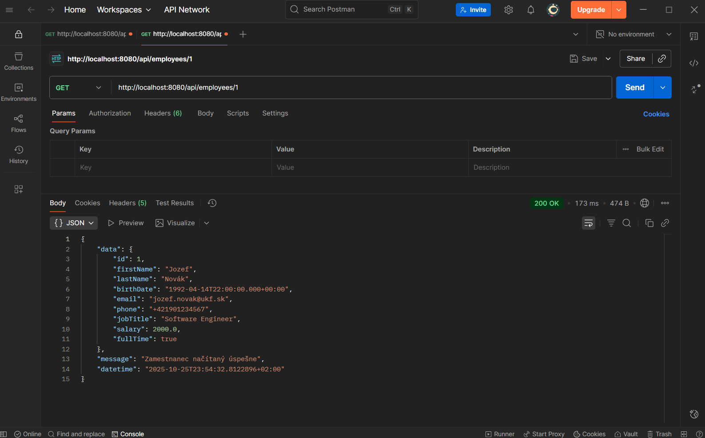
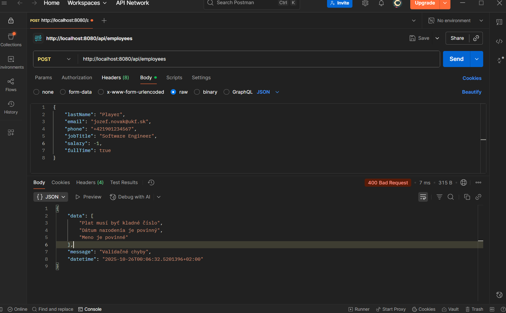
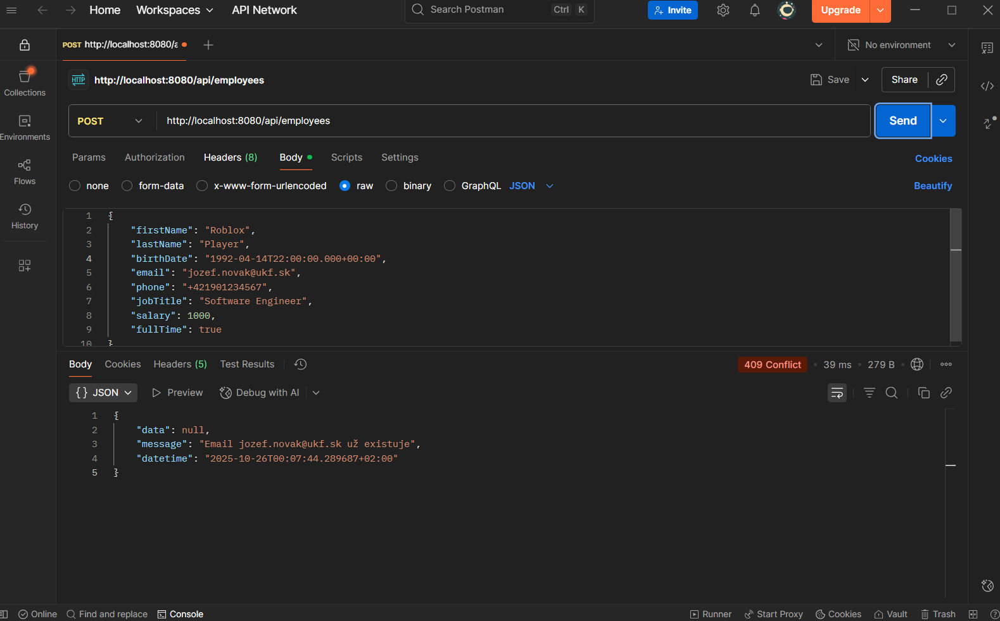
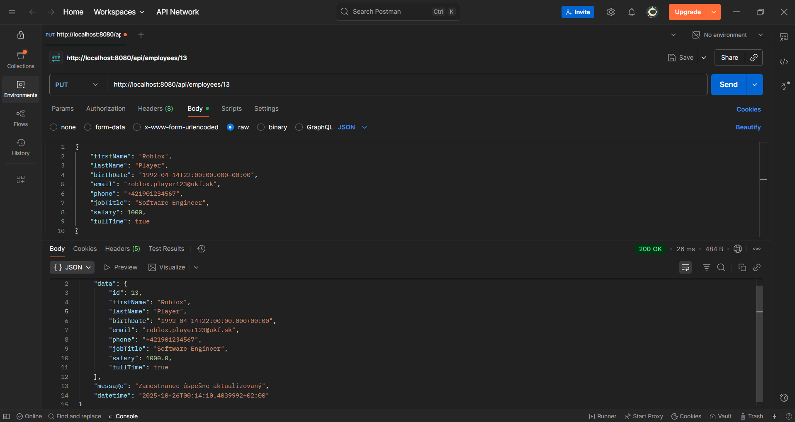
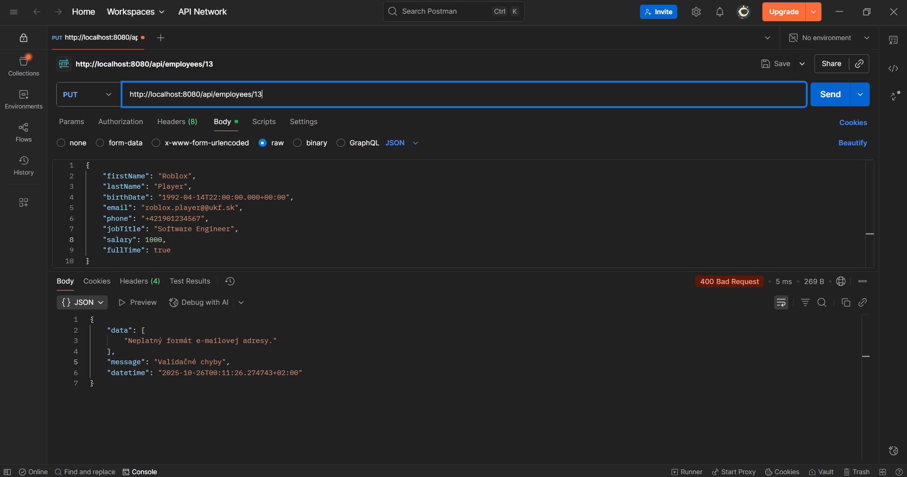
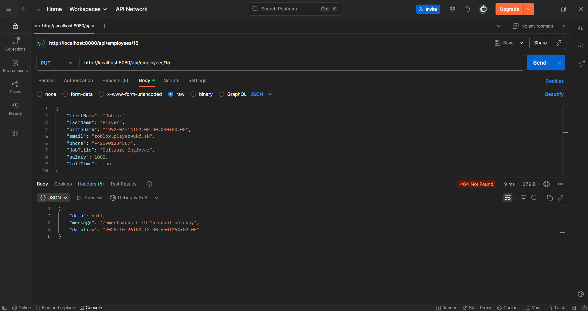
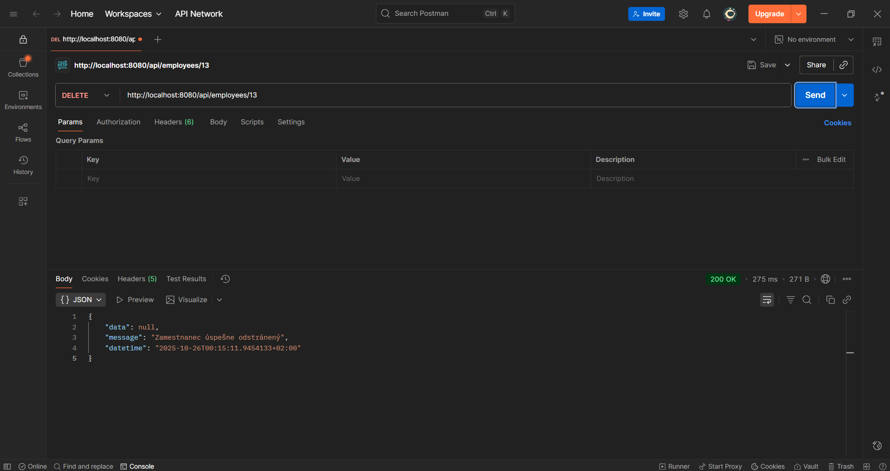
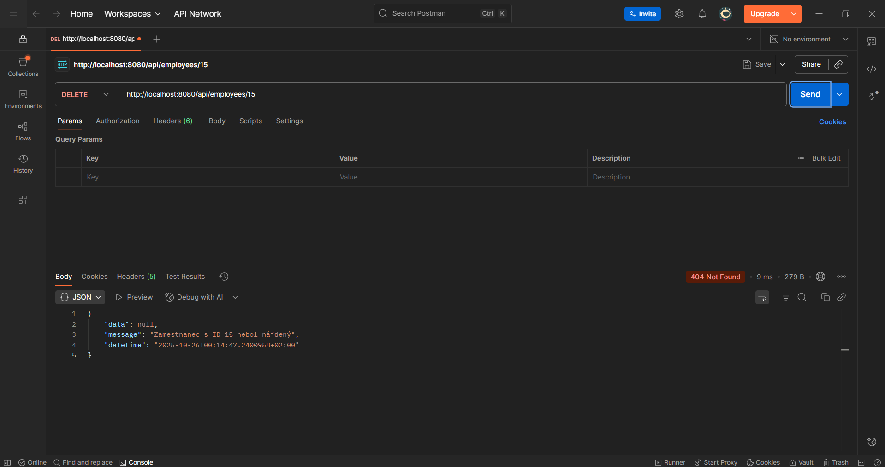

## 1️⃣ GET

### Success

### Exception / Not Found

---

## 2️⃣ POST

### Success

### Validation

### Email Already Exists

---

## 3️⃣ PUT

### Success

### Validation

### Not Found

---

## 4️⃣ DELETE

### Success

### Not Found
